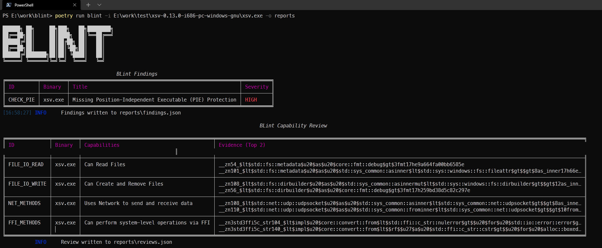

# BLint


BLint is a Binary Linter to check the security properties, and capabilities in your executables. It is powered by [lief](https://github.com/lief-project/LIEF). Since version 2, blint can also generate Software Bill-of-Materials (SBOM) for supported binaries.

[](https://asciinema.org/a/438138)

Supported binary formats:

- Android (apk, aab)
- ELF (GNU, musl)
- PE (exe, dll)
- Mach-O (x64, arm64)

You can run blint on Linux, Windows and Mac against any of these binary formats.

## Motivation

Nowadays, vendors distribute statically linked binaries produced by golang or rust or dotnet tooling. Users are used to running antivirus and anti-malware scans while using these binaries in their local devices. Blint augments these scans by listing the technical capabilities of a binary. For example, whether the binary could use network connections, or can perform file system operations and so on.

The binary is first parsed using lief framework to identify the various properties such as functions, static, and dynamic symbols present. Thanks to YAML based [annotations](./blint/data/annotations) data, this information could be matched against capabilities and presented visually using a rich table.

NOTE: The presence of capabilities doesn't imply that the operations are always performed by the binary. Use the output of this tool to get an idea about a binary. Also, this tool is not suitable to review malware and other heavily obfuscated binaries for obvious reasons.

## Use cases

- Quickly identify malicious binaries by looking at their capabilities (Ability to manipulate networks or drivers or kernels etc)
- Add blint to CI/CD to inspect the final binaries to ensure code signing or authenticode is applied correctly
- Identify interesting functions and symbols for fuzzing

## Installation

- Install python 3.10, 3.11, or 3.12

```bash
pip install blint
```

### Single binary releases

You can download single binary builds from the [blint-bin releases](https://github.com/OWASP-dep-scan/blint/releases). These executables should work with requiring python to be installed. The macOS .pkg file is signed with a valid developer account.

## Usage

```shell
usage: blint [-h] [-i SRC_DIR_IMAGE [SRC_DIR_IMAGE ...]] [-o REPORTS_DIR] [--no-error] [--no-banner]
             [--no-reviews] [--suggest-fuzzable]
             {sbom} ...

Binary linter and SBOM generator.

options:
  -h, --help            show this help message and exit
  -i SRC_DIR_IMAGE [SRC_DIR_IMAGE ...], --src SRC_DIR_IMAGE [SRC_DIR_IMAGE ...]
                        Source directories, container images or binary files. Defaults to current directory.
  -o REPORTS_DIR, --reports REPORTS_DIR
                        Reports directory. Defaults to reports.
  --no-error            Continue on error to prevent build from breaking.
  --no-banner           Do not display banner.
  --no-reviews          Do not perform method reviews.
  --suggest-fuzzable    Suggest functions and symbols for fuzzing based on a dictionary.

sub-commands:
  Additional sub-commands

  {sbom}
    sbom                Command to generate SBOM for supported binaries.
```

### SBOM sub-command

```shell
usage: blint sbom [-h] [-i SRC_DIR_IMAGE [SRC_DIR_IMAGE ...]] [-o SBOM_OUTPUT] [--deep]

options:
  -h, --help            show this help message and exit
  -i SRC_DIR_IMAGE [SRC_DIR_IMAGE ...], --src SRC_DIR_IMAGE [SRC_DIR_IMAGE ...]
                        Source directories, container images or binary files. Defaults to current directory.
  -o SBOM_OUTPUT, --output-file SBOM_OUTPUT
                        SBOM output file. Defaults to bom.json in current directory.
  --deep                Enable deep mode to collect more used symbols and modules aggressively. Slow
                        operation.
```

To test any binary including default commands

```bash
blint -i /bin/netstat -o /tmp/blint
```

Use -i to check any other binary. For eg: to check ngrok

```bash
blint -i ~/ngrok -o /tmp/blint
```

Pass `--suggest-fuzzable` to get suggestions for fuzzing. A dictionary containing "common verbs" is used to identify these functions.

```bash
blint -i ~/ngrok -o /tmp/blint --suggest-fuzzable
```

To generate SBOM in [CycloneDX format](https://cyclonedx.org/) for supported binaries, use the sbom sub-command.

```shell
blint sbom -i /path/to/apk -o bom.json
```

```shell
blint sbom -i /directory/with/apk/aab -o bom.json
```

To parse all files including `.dex` files, pass `--deep` argument.

```shell
blint sbom -i /path/to/apk -o bom.json --deep
```

PowerShell example



## Reports

Blint produces the following json artifacts in the reports directory:

- blint-output.html - HTML output from the console logs
- exename-metadata.json - Raw metadata about the parsed binary. Includes symbols, functions, and signature information
- findings.json - Contains information from the security properties audit. Useful for CI/CD based integration
- reviews.json - Contains information from the capability reviews. Useful for further analysis
- fuzzables.json - Contains a suggested list of methods for fuzzing

sbom command generates CycloneDX json.

## References

- [lief examples](https://github.com/lief-project/LIEF/tree/master/examples/python)
- [checksec](https://github.com/Wenzel/checksec.py)

## Discord support

The developers could be reached via the [discord](https://discord.gg/DCNxzaeUpd) channel.
